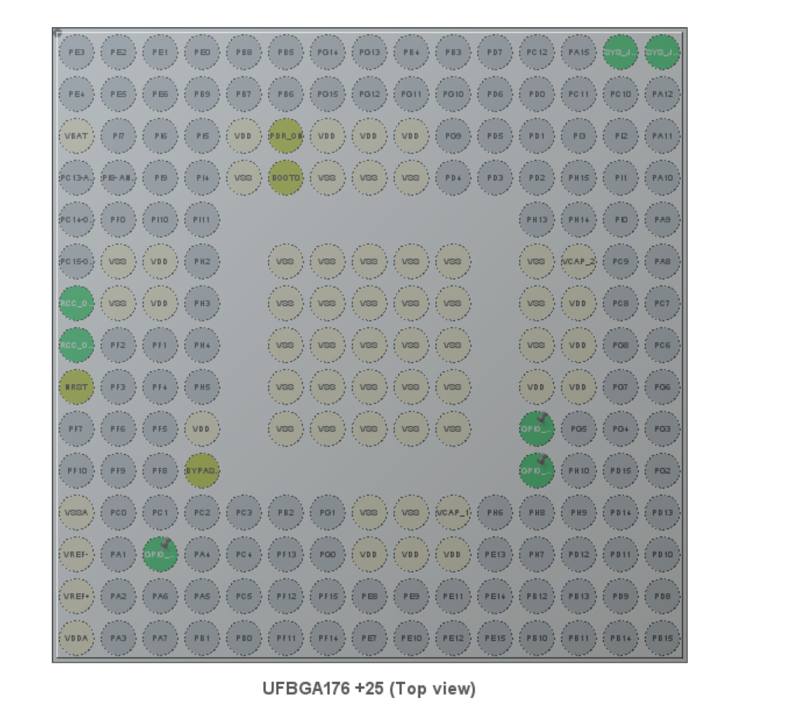
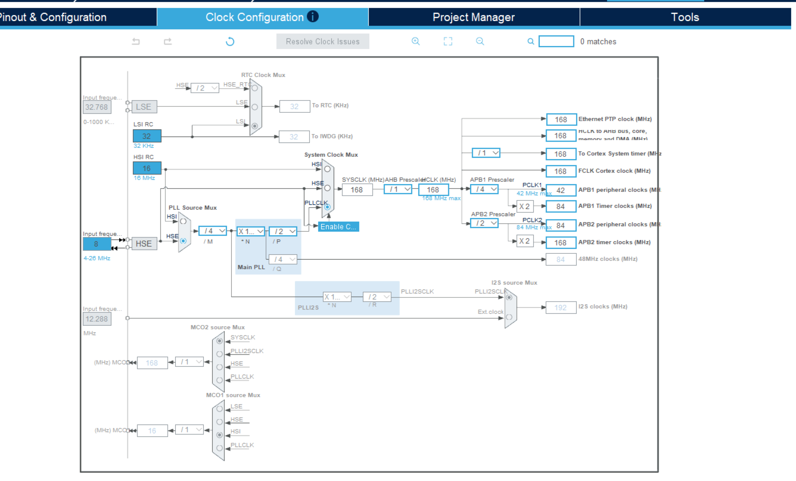
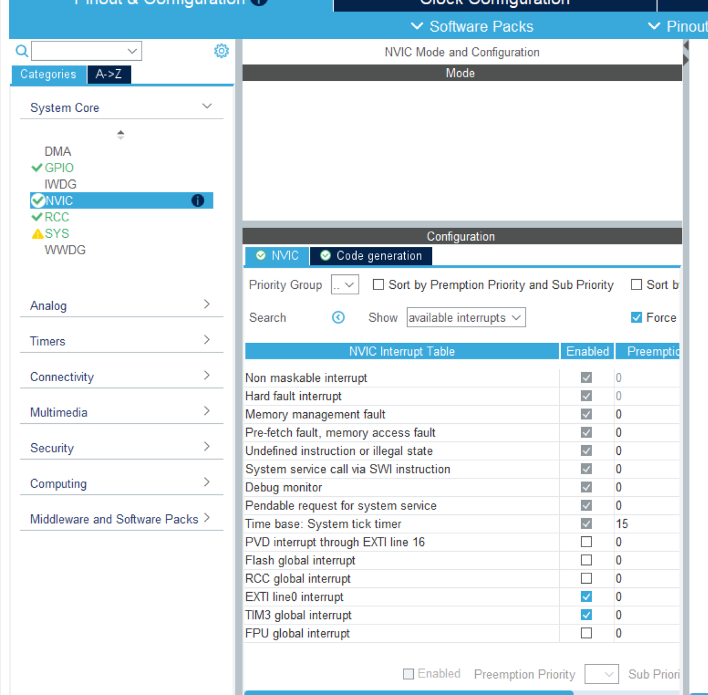
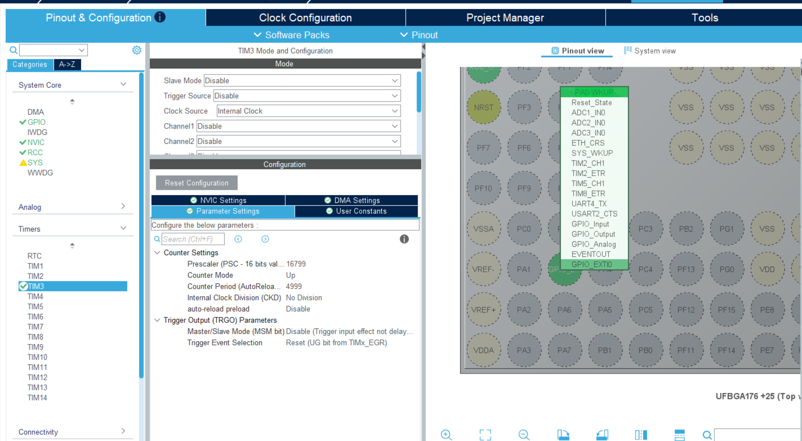

# 作业记录 LOG

## 第二次作业：串口与定时器配置(第二次任务直接做在了第一次的工程，第一次任务被覆盖了)

CubeMX 引脚配置截图：

说明：配置PH11，PH12 为 GPIO_Output，用来控制 LED 闪烁;配置了PH0为GPIO_EXIT0，用来控制中断。

时钟树配置截图：

说明：将 HSE（外部高速晶振）设置为 8MHz，将系统时钟倍频至 168MHz，APB1 分频系数设为 4，APB2 分频系数设为 2，其他未提及的配置保持 CubeMX 的默认值。

计时器配置截图：

说明：配置TIM3，用于产生 1s 的定时中断。

